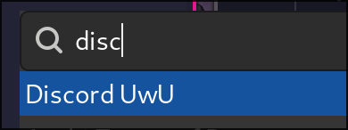

Today I learned that there are two important directories when it comes to launching an app in Linux:

- `/usr/share/applications`

- `~/.local/share/applications`

When an app you installed appears pixelated, it usually means that the app is not yet fully optimized for Wayland. To fix this, you typically only need to pass the following variables when launching the app:

```
--enable-features=UseOzonePlatform,WaylandWindowDecorations --ozone-platform=wayland
```

## How to Modify the Way Apps Start

As previously mentioned, there are two important directories:

- `/usr/share/applications` is a system-wide directory that contains `.desktop` files, which are usually overwritten by updates. This is why you shouldn't modify these files—it's futile.
- `~/.local/share/applications` is a user-specific directory that won't be overwritten by app updates. This is why you should always create and modify files there.

## My App Is Pixelated, What Should I Do?

1. Go to `/usr/share/applications` and check if there is an entry for your app. For example, `discord.desktop`.
2. If the entry exists, move it to your local directory:
    ```sh
    mv /usr/share/applications/discord.desktop ~/.local/share/applications/
    ```
	This way, you have a copy in a directory where we will be working.
3. Go to `~/.local/share/applications`, open the `.desktop` entry that interests you, and find the line that starts with `Exec=` (which usually contains the app name and some parameters). Append the Wayland parameters to the end of that line:

    ```sh
    --enable-features=UseOzonePlatform,WaylandWindowDecorations --ozone-platform=wayland
    ```

4. Save the file and check if the problem is solved. If not, search online and debug further. :3
    

### Pro Tip:

Sometimes, `.desktop` entries used to launch an app are stored in a different directory. During testing, I usually change the `Name=` parameter to something different to ensure that the app I'm launching comes from the `.desktop` file I just edited.

For example, in `~/.local/share/applications`, I edited the `discord.desktop` entry and changed it to:

```
Name=Discord uwu
```

If the app launcher displays "Discord uwu," I know my edited `.desktop` file is being used.


A sip of coffee is but a small kindnenss. [Support me on Ko-fi!](https://ko-fi.com/mlem_dev) :3
